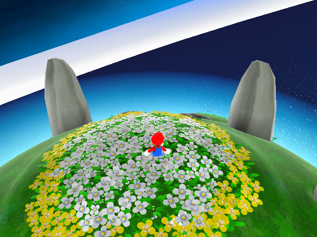

# Route smoke evidence

Source run: `/tmp/demo-scene-route-20260806`

Overall manifest status: `passed`; failures: none.

The copied `route-smoke/manifest.json` contains the exact scripted input, artifact paths, frame/image statistics, trace counts, and placement validation. Each copied trace-validator log reports `passed`.

## Captures

### Title, frame 90

Expected `TitleLogo` layout was present. Visual inspection shows the Korean retail title composition: the complete Super Mario Wii logo over the bright starfield/planet background.

Trace validator: 22 render packets, 170 semantic events, 23 layout-runtime records.

### File select, frame 1900

Expected `FileNumber` layout was present. Visual inspection shows all six numbered save-file planetoids against the starfield.

Trace validator: 27 render packets, 172 semantic events, 23 layout-runtime records.

### Picturebook, frame 7600

Expected `PrologueDemo` and `IconAButton` layouts were present. Visual inspection shows the first Korean picturebook page, illustration, localized text, and A-button prompt.

Trace validator: 390 render packets, 1,642 semantic events, 4 layout-runtime records.

### Gateway handoff, frame 10350

The scripted five-page picturebook advance reached the stage handoff. Visual inspection shows Mario rendered on the flower-covered opening planet.

Trace validator: 1,063 render packets and 3,459 semantic events. Placement validation passed with 242 total objects: 168 created, 72 intentionally ignored, and 2 blocked. Expected RailCoin, DemoRabbit, rail-attached DemoRabbit, and middle-zone StarPieceGroup counts all matched.

## Copied supporting data

- `route-smoke/manifest.json`
- four PNG captures above
- four trace-validator logs
- `route-smoke/gateway-handoff-placement-report.md`

The SQLite traces (about 62 MB total), verbose application logs, and temporary save images were intentionally not duplicated into notes; their original paths are retained in the manifest.
