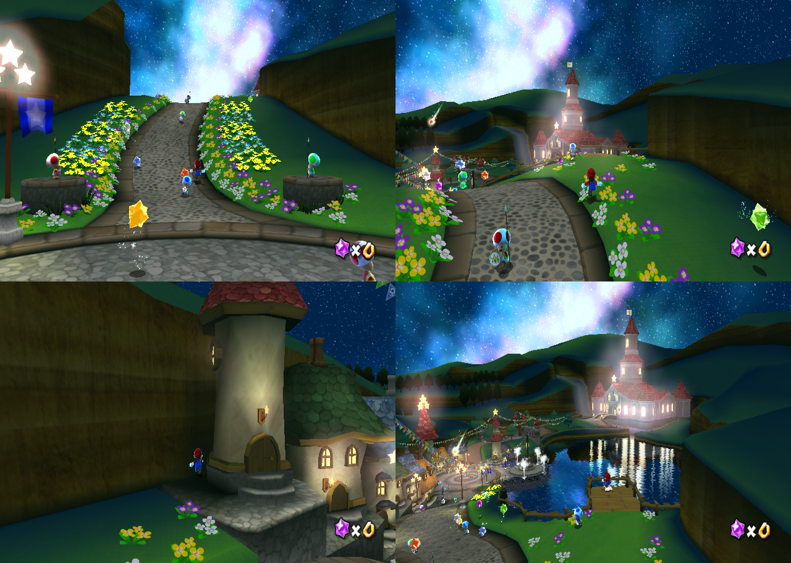

# Deterministic Dolphin Nunchuk oracle

Captured 2026-08-06 UTC. This checkpoint extends the modified local Dolphin controller oracle
with generic Nunchuk input and uses it to continue the original RMGK01 route from Peach's letter
into Star Festival traversal.

## Emulator outcome

Nested Dolphin commit `5895bce8fddc05265d24df5f763a078a55c2d9ed`
(`Core: add deterministic scripted Nunchuk input`) is committed and pushed to
`Frityet/dolphin` `master`. The nested worktree is clean and matches `origin/master`.

The implementation adds two optional Wii Remote 1 variables:

- `SMGPC_DOLPHIN_NUNCHUK_STICK_SCRIPT`
  - semicolon-separated inclusive spans in `first-last:x,y` form;
  - X and Y must each be finite and in `[-1,1]`;
  - a single frame and an open-ended range such as `11200-:0,1` are accepted;
  - the last matching span wins, matching the existing IR-pointer behavior.
- `SMGPC_DOLPHIN_NUNCHUK_BUTTON_SCRIPT`
  - uses the existing button-span grammar with `C`, `Z`, or `C+Z`;
  - overlapping active spans are ORed.

The override is installed on Dolphin's actual Nunchuk attachment, not the root Wii Remote
control group. Both scripts are driven by the same atomic unique-presented-frame counter as the
existing Wii Remote/IR scripts, screenshots, and render traces. Ordinary configured input is
preserved outside active spans. Other Wii Remotes are untouched. There are no memory addresses,
game identifiers, stage names, or route-specific branches in the emulator implementation.

## Verification

The rebuilt NoGUI binary contains both environment keys and completed successfully:

```text
cmake --build build-nogui-libcxx --target dolphin-emu-nogui -j4
```

Three focused Google Tests pass:

```text
[==========] Running 3 tests from 1 test suite.
[ RUN      ] ScriptedInput.NunchukStickUsesInclusiveRangesAndLastMatch
[       OK ] ScriptedInput.NunchukStickUsesInclusiveRangesAndLastMatch
[ RUN      ] ScriptedInput.NunchukButtonsComposeAndPreserveOrdinaryInput
[       OK ] ScriptedInput.NunchukButtonsComposeAndPreserveOrdinaryInput
[ RUN      ] ScriptedInput.NunchukRejectsInvalidOnlyScriptsAndOtherControllers
[       OK ] ScriptedInput.NunchukRejectsInvalidOnlyScriptsAndOtherControllers
[  PASSED  ] 3 tests.
```

The tests cover inclusive and open-ended ranges, overlap precedence, X/Y values, C/Z
composition, preservation of ordinary input, malformed/out-of-range rejection, unrelated control
groups, and Wii Remote index scoping.

## Original-route observations

All route probes used the hash-pinned seeded NAND and the previously proven title, file-select,
picturebook, and letter sequence. The common Wii Remote script includes the five picturebook
advances and the separate letter dismissal at `10400-10440:A`.



The contact sheet is ordered left-to-right, top-to-bottom:

1. Frame 11200, `10800-11200:0,1`: Mario is climbing the flower-lined road. This proves the
   Nunchuk attachment override affects original player movement end to end.
2. Frame 11400, `10800-11400:0,1`: Mario reaches the road crest with Peach's castle visible. He
   is offset onto the right grass edge.
3. Frame 12000, hard-left bound: a full-left 100-frame correction moves Mario behind a village
   tower against the boundary wall. This is an intentional upper-bound probe, not a route.
4. Frame 13000, shallow-correction bound: a quarter-left diagonal still reaches the waterfront
   dock, the same dead-end region as the uncorrected forward run.

Exact Nunchuk scripts:

```text
# Road climb
10800-11200:0,1

# Castle crest
10800-11400:0,1

# Hard-left upper bound
10800-11380:0,1;11381-11480:-1,0;11481-12000:0,1

# Shallow correction / dock bound
10800-11380:0,1;11381-11480:-0.25,0.968;11481-13000:0,1
```

The next deterministic route refinement is now narrowly defined: use a shorter or later
leftward correction between the frame-11400 crest and the frame-11600 dock arrival, then resume
forward on the castle bridge. Gateway was not reached in this checkpoint. The important result is
that original traversal is no longer blocked by the emulator input surface; remaining work is
route recording with ordinary analog spans.

## Trace evidence

Each original capture produced a committed, journal-free SQLite trace and passed the independent
validator with required `frame`, `render_packet`, and `semantic_event` records. The raw databases
are intentionally omitted from this compact note; their hashes, transient paths, and counts are
in `trace-summary.tsv`.

The runner manifests report `status=failed` only because these were Dolphin-only probes using the
paired parity wrapper with `/bin/false` as the PC executable after each Dolphin pair completed.
That wrapper status does not describe the validated Dolphin artifacts.

## Current PC camera comparison boundary

The current PC HeavensDoor camera pose supplied during this checkpoint is:

```text
eye   = (13402.355, -13412.122, 5614.236)
watch = (14441.642, -12997.257, 5986.099)
up    = (0.424969, -0.881984, -0.203730)
```

These original captures are still in `PeachCastleGardenGalaxy`, while the PC pose is from
`HeavensDoorGalaxy`. They therefore cannot be used as a same-scene numeric camera comparison.
The visual evidence shows the concrete state mismatch: original frame 11400 looks toward Peach's
castle, whereas the current PC handoff has already bypassed the Star Festival sequence. A valid
pose comparison requires reaching the corresponding original Gateway phase and capturing it with
the same frame/trace hook; this note does not invent an original pose from unrelated draw packets.

## Preserved evidence

- `screenshots/frame-11200-forward-road.png`
- `screenshots/frame-11400-castle-crest.png`
- `screenshots/frame-12000-hard-left-bound.png`
- `screenshots/frame-13000-shallow-correction-dock.png`
- `screenshots/route-contact-sheet.png`
- `manifests/`: exact expanded input and tool configuration
- `trace-summary.tsv`: independent validator counts and omitted-trace hashes
- `test-output.txt`: focused unit-test result
- `artifacts.sha256`: hashes for every committed screenshot and manifest

No PC `Game/`, compatibility, renderer, scene, or runtime source was changed by this work.
