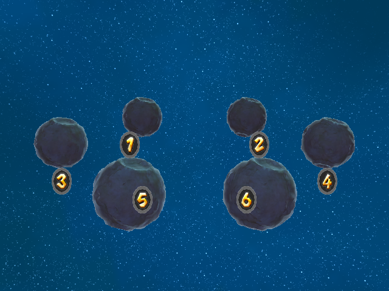
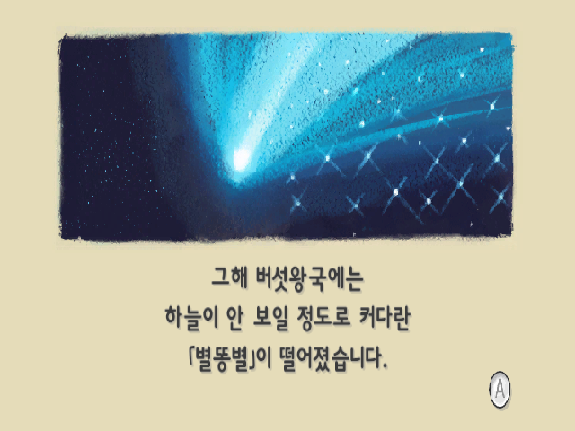

# Title, file-select, and picturebook route regression

Updated: 2026-08-06T19:32:55Z

## Outcome

The Aurora-native real-disc route harness passes its canonical title, file-select, and prologue-picturebook checkpoints after the StageSwitch and CollisionBlocker imports. This establishes an explicit regression gate for the required front half of the final demo instead of treating HeavensDoor as a direct-boot-only target.

The durable screenshots and compact trace-validator data are stored in this note's `artifacts/` directory. The complete transient capture set, including SQLite traces and application logs, is at `/tmp/smgpc-full-sequence.UQ7JfN/` in the originating workspace.

| Checkpoint | Frame | Required layout(s) | Render packets | Non-black ratio | Result |
| --- | ---: | --- | ---: | ---: | --- |
| Title | 90 | `TitleLogo` | 22 | 1.0000 | passed |
| File select | 1900 | `FileNumber` | 27 | 0.9998 | passed |
| Picturebook | 7600 | `PrologueDemo`, `IconAButton` | 13 | 1.0000 | passed |

The harness begins from normal sequence boot, holds the scripted A+B title input, drives the file-select pointer/A path, and reaches the first prologue-picturebook page. No direct HeavensDoor boot variable is used.

## Visual inspection

The three captures were inspected directly:

- the title capture shows the rendered Korean-disc Super Mario Wii logo over the star field and globe;
- the file-select capture shows all six numbered save planets against the star field; and
- the picturebook capture shows the Korean first-page text, illustration, and A-button prompt.

### Title


### File select



### Prologue picturebook



This is route-preservation evidence, not visual parity proof. The final demo still requires an interactive continuation from the picturebook through Gateway gameplay and spin acquisition.

## Harness repair

The first invocation incorrectly reported that `Xvfb` was missing even though `/usr/bin/Xvfb` was executable. xmake's detector did not resolve the mixed-case executable name. `scripts/common.lua::require_tool` now has a general, case-preserving PATH fallback after the normal detector, so all script tools—not just Xvfb—can be found by their exact executable names.

Reproduction:

```text
xmake aurora-route-smoke --no-build \
  --disc=/workspaces/pcport/RMGK01.wbfs \
  --work-dir=/tmp/smgpc-full-sequence.UQ7JfN \
  title file_select picturebook

aurora-route-smoke: title passed
aurora-route-smoke: file_select passed
aurora-route-smoke: picturebook passed
aurora-route-smoke: passed manifest=/tmp/smgpc-full-sequence.UQ7JfN/manifest.json
```
