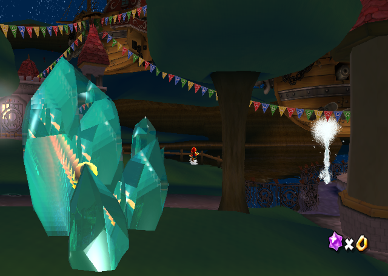
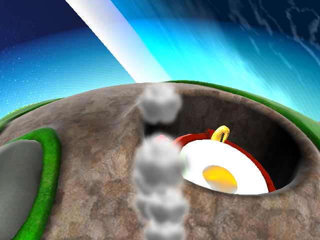
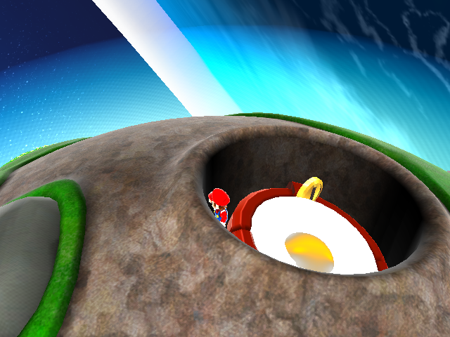

# JPC world-billboard and duplicate-host verification

Date: 2026-08-06 UTC
Branch: `pcp-aurora`
Tested HEAD: `6e4776b99acc25077673a6fbd6c4938602e9f7dd` plus the uncommitted JPC changes documented here

## Outcome

World-draw JPC particles no longer send world X/Y/Z coordinates through the
screen-space textured-quad path. Shape-type 2 parent and child particles now
form their quad from the active camera's normalized right/up basis and submit it
through the existing 3D GX material path. The packet retains the parsed JPC
texture, TEV stage/register colors, alpha compare, blend mode, depth test,
depth write, and depth compare. Actual `2D` and `2DModel` draw-order effects
retain the old screen-space path.

The PC emitter simulation retains particle centers in host-local coordinates.
Those centers now pass through the binding's complete row-major 3x4 affine
matrix before packet construction. Rotation and scale therefore affect the
local emission path as well as translation; the previous
`local + host_translation` calculation discarded nine stored basis values.

The change also fixes a separate generalized ownership problem exposed by the
Gateway objects: all eight `SimpleEffectObj` instances are named `Steam`.
Effect keepers, bindings, active instances, and teardown now use the host object
identity while retaining the decompiled actor name as the resource and trace
label. No stage name, effect name, coordinate, or Gateway-specific exception is
present in the implementation.

## Root-source oracle

The source and Dolphin evidence is retained in
[`../dolphin-gateway-jpa-oracle-20260806T231821Z`](../dolphin-gateway-jpa-oracle-20260806T231821Z/README.md).
The relevant root behavior is:

1. `JPAEmitterManager::draw` installs the camera matrix in
   `JPAEmitterWorkData::mPosCamMtx`.
2. `JPADrawBillboard` and `JPADrawRotBillboard` transform the particle center
   with that matrix.
3. Their canonical quad offsets lie in camera-space X/Y at the transformed
   center depth. The rotated version applies the particle rotation to those X/Y
   offsets.
4. Shape type 2 selects these billboard routines for both parent and child
   particles. Gateway `Steam01` has shape type 2 for both; `Steam00` is a
   direction shape (type 4).

The host-matrix requirement is also explicit in the root source:

1. `MultiEmitterCallBack::setSRTFromHostMtx` decomposes the host matrix with
   `JPASetRMtxSTVecfromMtx`, then updates emitter global translation, rotation,
   and scale.
2. `JPAResource::calcWorkData_c` builds `mGlobalPos`, `mGlobalRot`, `mGlobalSR`,
   and `mPublicScale` from those values.
3. `JPAParticle::{init_p,calc_p,calc_c}` uses that work data to produce the
   world-space `mPosition` later consumed by `JPADrawBillboard`.

Consequently, applying only host translation in the PC representation was not
source-faithful. `jpc_transform_particle_center` now performs the generalized
3x4 point transform at the local-to-world boundary. The focused test uses a
matrix containing non-uniform scale, a 90-degree Z rotation, and translation;
it checks local `(1,2,-0.5)` becomes world `(4,22,28)` before exercising the
translated/rotated camera billboard test.

Constructing the vertices in world space from camera right/up and then using
the renderer's existing world-to-camera transform is algebraically equivalent
to the root type-2 path. The focused test transforms the generated vertices
back to camera space and checks their exact X/Y offsets and common depth under a
translated, rotated, and rolled camera. A 90-degree particle rotation test
checks the signs from `JPADrawRotBillboard` as well.

The original frame-21250 Dolphin image shows a coherent world-attached plume at
image right, but the accompanying oracle correctly does **not** identify that
visible plume as Gateway `Steam` by resource name:



## Before and after at the old failure viewpoint

Before, one name-keyed `Steam` instance produced 70 unbound packets at
translation `[0,0,0]`. Sending their world coordinates through the 2D quad API
made the IA8 particles form a vertical stack at the screen center:



After, the same real-disc route and frame with the same final camera input has
no screen-center stack:



The after trace from the preserved real-disc `gateway_handoff` route records
548 `Steam` packets. Every packet is world-space and host-bound, distributed
over eight distinct actor translations. The type-2 total includes 176 parent
and 199 child packets, so both dispatch branches reached the 3D billboard path.
See
[`data/packet-summary.tsv`](data/packet-summary.tsv) and
[`data/steam-host-translations.tsv`](data/steam-host-translations.tsv).

The eight host translations are not inferred from the image: they are the
per-packet `LiveActorBaseMatrix` bindings recorded by the PC parity trace. This
is the direct evidence that the same-name actors remain separate and that each
particle center is offset from its actual emitter instead of an origin/name
collision.

## Identity lifecycle audit

The pointer-key conversion exposed one additional cleanup problem:
`RuntimeContext::unregister_effect_keeper` removed the keeper, binding, and host
lookup but left the pointer in both scene-scope identity maps. A destroyed
object's address could therefore survive until scene teardown and, if reused,
target an unrelated replacement object. Unregister now erases the identity from
both `_scene_effect_keeper_instances` and
`_scene_effect_emission_instances`. The existing duplicate-host test continues
to verify that unregistering one same-name host removes only its effect and
preserves the other host.

## Packet-path limitation kept explicit

`Steam01` parent/child packets (shape type 2) use the root-derived
`JpcBillboard3D` path. `Steam00` is shape type 4, whose direction-shape geometry
has not yet been implemented. Its packets deliberately use
`JpcWorldShapeFallback3D`: a camera-facing world quad that preserves its world
center and full material/depth state. This is a safe generalized fallback that
prevents any 3D JPC shape from silently returning to screen coordinates, but it
is not claimed to reproduce root direction-shape orientation. The trace names
that fallback separately so later shape-specific work is measurable.

## Reproduction and checks

The preserved route was run against the real `RMGK01.wbfs` disc:

```sh
xmake aurora-route-smoke \
  --disc=/workspaces/pcport/RMGK01.wbfs \
  --work-dir=.cache/jpc-world-billboard-after \
  --timeout=240 --display=304 --no-build gateway_handoff
```

The route passed at frame 10350 with non-black ratio `1.0000` and 1063 render
packets. For the matching old crater viewpoint, the deterministic route input
was extended with `9800-10340:RIGHT;10345-10350:ONE`; the after screenshot above
was captured at frame 10350 from that run.

Focused and product builds:

```text
xmake build smg-pc-jpc-billboard-tests
xmake run smg-pc-jpc-billboard-tests
[ok] default camera matches view XY billboard
[ok] translated rotated camera preserves view offsets
[ok] rotated billboard matches oracle matrix
[ok] packet path keeps 2D and selects world billboards
[ok] duplicate names keep distinct effect hosts
5 JPC billboard test(s) passed

xmake build smg-pc
build ok

git diff --check
(no output)
```
