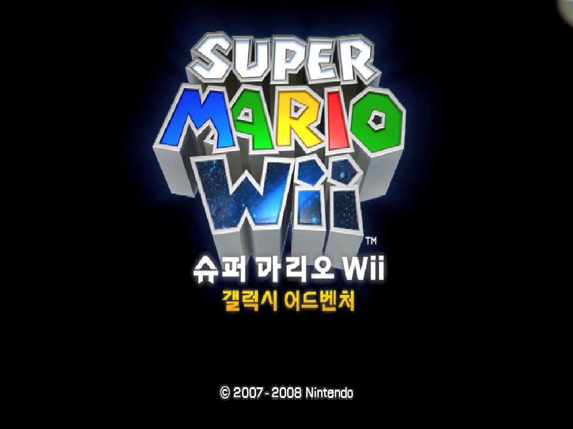
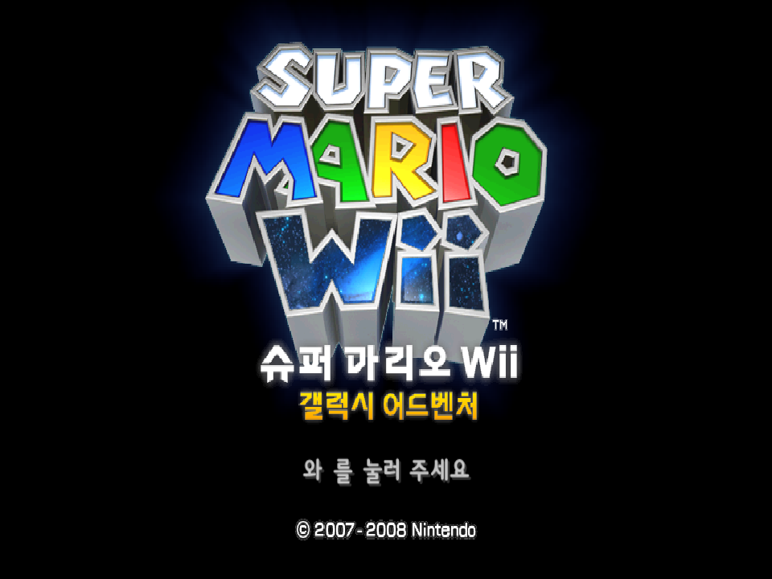

# Exact retail title showcase release

This is the strongest route that is currently honest end to end: the PC host
runs the retail `TitleSequenceProduct`, reads its original resources from a
user-supplied RMGK01 disc through Aurora DVD, accepts the host A+B input, and
lets the retail component reach its own dead state. It is deliberately a
title-only showcase.





## Exact-source boundary

- `pc-port/src/Game/Screen/TitleSequenceProduct.cpp` is byte-identical to
  `src/Game/Screen/TitleSequenceProduct.cpp` (`cmp` exit 0).
- `pc-port/src/Game/Screen/TitleSequenceProduct.hpp` is byte-identical to
  `include/Game/Screen/TitleSequenceProduct.hpp` (`cmp` exit 0).
- The showcase-specific code supplies only the host window, renderer, input,
  disc, and frame-loop plumbing. This release task changed no runtime or Game
  source file.

## Artifact

- Directory:
  `pc-port/build/showcase-dist/smg-pc-title-showcase-linux-x86_64-20260808T204728Z/`
- Archive:
  `pc-port/build/showcase-dist/smg-pc-title-showcase-linux-x86_64-20260808T204728Z.tar.gz`
- Archive size: 9,680,084 bytes
- Archive SHA-256:
  `cf6d4aed70ffd5d428b37cac007777f5151d257f08185912f9e6fcea427499e0`
- Executable size: 23,452,072 bytes
- Executable SHA-256:
  `e4d35a890c9c8ed86da57a08f82c7ff95816d552647669935448aad27b21e18a`

The executable in the package is byte-identical to the successfully exercised
release build (`cmp` exit 0 and the same SHA-256). The archive contains five
regular files plus the `bin/` directory. It contains no disc image, extracted
disc file, game asset, generated source tree, or fallback content.

`BUILD-INFO` truthfully records source commit
`0c88b7c93f93161d52c8ace9afbc0f2fd549a78f` with a dirty source worktree and
clean Aurora commit `4a21d57c0012943aca1c895c4fd88dc20a478c0c`.
The dirty marker matters: the commit is a provenance anchor, not a claim that
the executable came from a clean checkout.

## Runtime proof

Two independent runs of the stripped release executable completed with exit
status 0 against `/workspaces/pcport/RMGK01.iso` under Xvfb:

1. Frame 210 was captured, Enter+Backspace was held, and the retail component
   completed at frame 334.
2. Frame 250 was captured with the Korean A+B prompt visibly rendered,
   Enter+Backspace was held, and the retail component completed at frame 357.

Both runs resolved the original `TitleLogo`, `PressStart`, and `SysPALInfo`
layout archives. They loaded 1,994 Korean messages, 3,327 particle names and
resources, and 225 particle textures; emitted `TitleLogoLight` through
`TitleLogoLightG`; and then observed the retail decision requests to stop
`STM_TITLE`, play `SE_SY_GAME_START`, and play `CS_CLICK_CLOSE` before the
component completed.

The release ELF is an x86-64 position-independent executable. Xmake release
mode used `NDEBUG`, fastest optimization, and the `build.release.strip`
policy. `nm` reports no symbols, no `.symtab` or `.debug_*` section is present,
and `ldd -r` reports no missing library or unresolved symbol.

Two follow-up launches through the packaged convenience script were
inconclusive under heavy concurrent host CPU pressure. The first reached all
three retail archives and all seven title effects just as its 75-second bound
expired, before input could be injected. The second was stopped cleanly at a
130-second bound while still initializing disc resources. These attempts are
not presented as successful packaged-launcher runs. The package executable is,
however, byte-for-byte the same file as the release executable that completed
twice above.

## Run it

Requirements are Linux x86-64 with glibc 2.34 or newer, an X11 or Xwayland
display, a Vulkan-capable GPU and driver, and a readable user-owned retail disc
image supported by Aurora.

From the extracted directory:

```sh
./run-title-showcase.sh /path/to/your/disc-image
```

At the prompt, hold keyboard A+B or Enter+Backspace.

File select and picturebook remain explicit acceptance targets for the main
port. This title-only package does not claim either sequence, Gateway gameplay,
stage selection, or the spin route.
